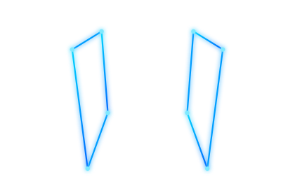

<!-- ============================================================= -->
<!--  README de Jorge                                              -->
<!-- ============================================================= -->

<div align="center">


</div>

---

## 💻 Sobre mí

```js
const jorge = {
  rol:        "Encargado de IT / Sistemas",
  estudiando: "ICOM @ CUALTOS (UdeG)",
  aprendiendo: ["C", "Vue", "TypeScript", "JavaScript", "Backend", "Ciberseguridad"],
};
```

- 🖥️ Levanto y administro **servidores SQL, redes y cámaras**
- 🧠 Aprendiendo **C, Vue, TypeScript y JavaScript** a fuego lento, metiéndole también a **backend** y **ciberseguridad**
- 🔒 Interés fuerte en seguridad ofensiva/defensiva y hardening de sistemas
- 🧩 Programo apoyándome en **IA**: uso **Claude** como copiloto para prototipar, depurar y automatizar más rápido

---

## 🛠️ Mi Stack

<table>
<tr>
<td valign="top">

<b>Lenguajes</b>


<b>Frontend & Web</b>


<b>Datos</b>


<b>Sistemas</b>


<b>Herramientas</b>


</td>
<td align="center" valign="middle">



</td>
</tr>
</table>

---

## 🚀 Proyectos destacados

| Proyecto | Descripción | Estado | Enlace |
| :------- | :---------- | :----- | :----- |
| **RustBlood** | Sitio web — frontend, diseño y despliegue |  | [rustblood.com](https://rustblood.com) |
| **YohoHielo** | Sitio de venta de hielo premium |  | [yohohielo.vercel.app](https://yohohielo.vercel.app/) |
| **BAO Textil** | Tienda de textiles para el hogar |  | [bao-textil.vercel.app](https://bao-textil.vercel.app/) |

> 🚧 *YohoHielo y BAO Textil están en **beta**; sigo trabajando en ellos.*

---

## 📫 Contacto

[](mailto:jorgemantin@gmail.com)
[](https://www.linkedin.com/in/jorge-martin-gomez14/)
[](https://instagram.com/jorge_margomz)
[](https://www.facebook.com/profile.php?id=100078654099312)
[](https://github.com/jorgemg1414)

---

<div align="center">


<br/>


<br/>

<picture>
  <source media="(prefers-color-scheme: dark)" srcset="https://raw.githubusercontent.com/jorgemg1414/jorgemg1414/output/github-snake-dark.svg" />
  <source media="(prefers-color-scheme: light)" srcset="https://raw.githubusercontent.com/jorgemg1414/jorgemg1414/output/github-snake.svg" />
  
</picture>

<br/><br/>

**Sysadmin · Developer.** 💻


</div>
